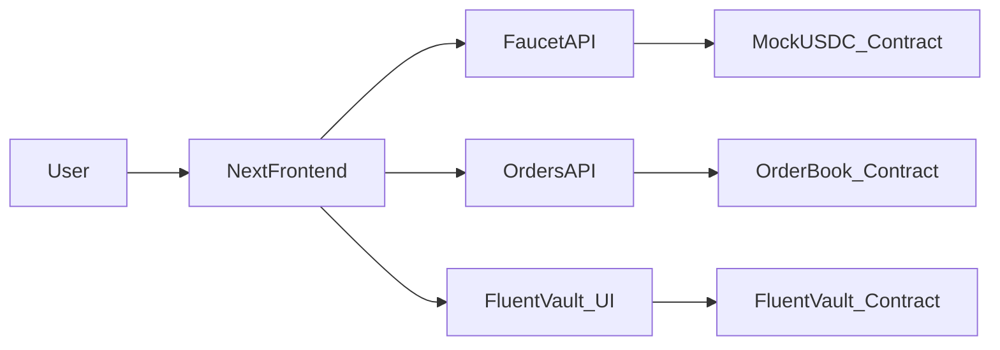

## 目标

- **整体目标**：在当前仓库内，按你给出的完整规格，实现一个基于 pnpm workspace 的 FluentVault Web3 工业级项目，覆盖合约、前后端、Gasless 流程和 README，能直接作为面试作品展示。
- **约束与偏好**：
  - 使用 **pnpm workspace** 管理 monorepo。
  - 合约使用 **Foundry + OpenZeppelin v5**，Solidity `^0.8.20`。
  - 前端使用 **Next.js 14 App Router + TypeScript + Tailwind CSS**，并锁死 `wagmi@2.x`、`viem@2.x`、`@tanstack/react-query@5.x`、`framer-motion`、`lucide-react`。
  - 后端基于 Next.js API Route，实现 **Upstash Redis 限流** 和 **Gasless Relayer**。
  - 保持代码风格统一（ESLint + Prettier），并准备 `.env.example`。

## 步骤一：Monorepo 与基础设施搭建

- **1.1 初始化 pnpm workspace 结构**
  - 在根目录创建 `package.json`，配置 `private: true` 与 `workspaces` 指向 `packages/*`。
  - 创建目录结构：
    - `packages/contracts`
    - `packages/frontend`
  - 配置 `pnpm-workspace.yaml` 使上述两个包被正确识别。
- **1.2 工具与脚本约定**
  - 在根 `package.json` 增加统一脚本：
    - `dev:contracts`、`test:contracts` 对应 Foundry。
    - `dev:frontend`、`build:frontend` 对应 Next.js。
    - 可选：`dev` 一键并行启动前端和本地链/监听脚本。
- **1.3 ESLint / Prettier 统一配置**
  - 在根创建：
    - `.eslintrc.cjs`（或 `.eslintrc.js`）：
      - 使用 TypeScript + React + Next 推荐规则。
      - 配置 import/order 规则和基础代码质量规则。
    - `.prettierrc`：统一缩进、引号、分号、printWidth 等。
    - `.editorconfig`：确保不同编辑器行为一致。
- **1.4 CI/CD 工作流（GitHub Actions）**
  - 在根目录新增 `.github/workflows/ci.yml`：
    - 触发条件：对 `main` / `develop` 分支的 push 和 PR。
    - Job 步骤：
      - 使用官方 `actions/setup-node` 配置 Node + pnpm 缓存。
      - 运行 `pnpm install --frozen-lockfile`。
      - 运行 `pnpm lint` 校验前端 / 通用 TS 代码。
      - 在 `packages/contracts` 下运行 `forge test`（必要时先安装 Foundry）。
    - 在 README 中预留 CI Badge（Passing/Failing）占位，展示工程化能力。
- **1.5 环境变量模板**
  - 在根创建 `.env.example`：
    - 包含：
      - `SEPOLIA_RPC_URL`
      - `ETHERSCAN_API_KEY`
      - `FAUCET_PRIVATE_KEY`
      - `NEXT_PUBLIC_CHAIN_ID` / `NEXT_PUBLIC_RPC_URL`
      - `UPSTASH_REDIS_REST_URL`
      - `UPSTASH_REDIS_REST_TOKEN`
      - `SUPABASE_URL` / `SUPABASE_ANON_KEY` 或标记为可选
    - 写清注释：哪部分由 Foundry 使用，哪部分由 Next API 使用。

## 步骤二：Foundry 合约包（ERC-4626 & 策略模式）

- **2.1 初始化 Foundry 项目**
  - 在 `packages/contracts` 内：
    - 运行 `forge init` 风格的结构（在实施阶段用 Foundry 命令生成）。
    - 更新 `foundry.toml`：
      - 指定 Solidity 版本 `^0.8.20`。
      - 配置 `rpc_endpoints`（`sepolia = "${SEPOLIA_RPC_URL}"`）。
      - 配置 `etherscan_api_key` 模板（`sepolia = "${ETHERSCAN_API_KEY}"`）。
      - 配置 `libs` 引用 OpenZeppelin v5（通过 `lib/openzeppelin-contracts`）。
- **2.2 引入 OpenZeppelin v5**
  - 使用 `git submodule` 或 `forge install` 方式拉取 `openzeppelin-contracts`。
  - 在合约中统一从 OZ v5 路径导入：如 `import { ERC20, ERC20Permit } from "openzeppelin-contracts/token/ERC20/extensions/ERC20Permit.sol";`（在实现时根据实际目录调整）。
- **2.3 实现 `MockUSDC.sol`**
  - 放在 `src/MockUSDC.sol`：
    - 继承 `ERC20` + `ERC20Permit`，名字和符号为 `MockUSDC` / `mUSDC`。
    - 使用 NatSpec 注释说明用途（测试代币，支持 Permit）。
    - 定义构造函数一次性给部署者铸造初始供给（或提供 `mint` 仅 owner 调用）。
    - 使用 **Custom Errors** 替代 `require` 字符串（如 `error NotOwner();`）。
- **2.4 策略接口 `IYieldStrategy.sol`**
  - 放在 `src/interfaces/IYieldStrategy.sol`：
    - 定义：
      - `function invest(uint256 assets) external;`
      - `function getTotalValue(address asset) external view returns (uint256);`
    - 使用 NatSpec 详细描述参数和返回值含义。
- **2.5 模拟策略 `MockYieldStrategy.sol`**
  - 放在 `src/strategies/MockYieldStrategy.sol`：
    - 实现 `IYieldStrategy`：
      - 存储：
        - 初始投资时的时间戳。
        - 单个 asset 的总 principal。
      - 通过 `block.timestamp` 计算按 10% APY 的复利：
        - 预先定义每秒的收益率或使用 `r = 0.1 / yearInSeconds`。
        - 采用定点数近似方案避免浮点。
      - `getTotalValue` 返回原始本金 + 累计收益。
    - 留出可扩展接口（比如支持多资产、不同策略 ID）。
- **2.6 FluentVault（`FluentVault.sol`）实现**
  - 放在 `src/FluentVault.sol`：
    - 继承 `ERC4626`、`ReentrancyGuard`。
    - 构造函数：
      - 接收 `IERC20 asset` 与 `IYieldStrategy strategy` 地址。
      - 初始化 ERC20 share 名称 / 符号，如 `FluentVault Share`。
    - 重写 `totalAssets()`：
      - 通过 `strategy.getTotalValue(address(asset))` 获取资产总量。
    - 实现 `_afterDeposit` 钩子：
      - 在存入成功后调用 `strategy.invest(assets)`。
      - 使用 `nonReentrant` 修饰相关外部入口（如 `deposit`/`mint`）。
    - 使用 NatSpec + Custom Errors，说明安全假设和失败条件。
- **2.7 OrderBook 合约：EIP-712 验证 + 链上结算闭环**
  - 放在 `src/OrderBook.sol`：
    - 继承 `EIP712`（OZ 实现） + 自定义存储。
    - 定义 `struct Order`，包含：价格、期限、nonce、maker、vault 等字段。
    - 实现 `verifyOrder(Order calldata order, bytes calldata signature) public view returns (bool)`：
      - 计算 EIP-712 digest。
      - 使用 `ECDSA.recover` 恢复 signer。
      - 检查 signer == order.maker，且未过期、nonce 未被使用。
    - 新增 `executeOrder` / `fillOrder` 函数，完成“链下撮合、链上结算”的闭环：
      - 由后端 Relayer 调用，传入订单结构与签名。
      - 内部首先复用 `verifyOrder` 进行签名与业务规则检查，并标记 nonce 已使用，防重放。
      - 利用 ERC20 Permit（EIP-2612）或事先授予的 allowance，通过 `transferFrom` 从 maker 账户扣除 MockUSDC。
      - 根据订单类型，将资产直接结算给 taker，或将资产存入 `FluentVault`，实现“下单即入金库赚收益”的限价单示例。
      - 触发 `OrderFilled` 事件，包含 orderId、maker、filledAmount 等字段，供前端和 indexer 订阅。
- **2.8 基本测试与脚本**
  - 在 `test/` 中添加：
    - `MockUSDC.t.sol`：测试 mint、transfer、permit。
    - `MockYieldStrategy.t.sol`：测试收益增长曲线。
    - `FluentVault.t.sol`：测试 `deposit/withdraw`、`totalAssets` 与策略联动。
    - `OrderBook.t.sol`：测试 EIP-712 签名的 `verifyOrder`。
  - 为部署与本地预配置编写 `script/Deploy.s.sol`。

## 步骤三：Next.js 14 前端 / 后端初始化

- **3.1 在 `packages/frontend` 初始化 Next 14 App Router 项目**
  - 使用 `create-next-app` 风格结构（在实施时通过命令生成）：
    - `app/` 目录：`layout.tsx`、`page.tsx`。
    - TypeScript + Tailwind 模板。
  - 配置 `tsconfig.json`、`next.config.mjs`，并确保使用 App Router。
- **3.2 安装并锁定依赖版本**
  - 在 `packages/frontend/package.json` 中：
    - 安装并锁定：
      - `next@14.x`
      - `react`, `react-dom`
      - `tailwindcss`, `postcss`, `autoprefixer`
      - `wagmi@2.x`
      - `viem@2.x`
      - `@tanstack/react-query@5.x`
      - `framer-motion`
      - `lucide-react`
      - `@radix-ui/react-*`（供 shadcn/ui 组件使用）
- **3.3 Tailwind & 全局样式**
  - 配置 `tailwind.config.ts`：
    - 启用 `darkMode: "class"`。
    - 添加 `tabular-nums` 字体特性。
  - 更新 `app/globals.css`：
    - 引入深色背景与 DeFi 风格基础样式。
- **3.4 前端 Wagmi / Viem / React Query Provider 布局**
  - 在 `app/providers.tsx` 或 `app/layout.tsx` 中：
    - 配置 `WagmiConfig`，使用 `viem` client 指向 Sepolia。
    - 配置 `QueryClientProvider` 包裹全局。
    - 提供 `ThemeProvider`（支持暗色模式）。

## 步骤四：Gasless 后端（Faucet + Relayer）

- **4.1 Upstash Redis 客户端封装**
  - 在 `packages/frontend` 中创建 `lib/redis.ts`：
    - 封装对 Upstash REST API 的访问（使用官方 SDK 或 fetch）。
    - 暴露通用函数：`incrementAndCheckLimit(key: string, max: number, ttl: number)`。
- **4.2 /api/faucet 领水接口**
  - 在 `app/api/faucet/route.ts` 中（App Router 风格）：
    - 接收用户钱包地址与可选 captcha/token（后续可扩展）。
    - 使用 IP + 地址双 key 组合在 Upstash 中做限流：
      - 如 `faucet:ip:${ip}`、`faucet:addr:${address}`。
      - 若超过限制，返回 429。
    - 使用 `viem` 的私钥账户：
      - 从 `.env` 中读取 `FAUCET_PRIVATE_KEY`。
      - 调用 `MockUSDC` 的 `mint` 或 `transfer`，给用户发放 10,000 `MockUSDC`。
    - 返回交易哈希或状态。
- **4.3 /api/orders Relayer + 存储**
  - 在 `app/api/orders/route.ts` 中：
    - 接收前端上传的 EIP-712 签名订单（结构与 `OrderBook.Order` 一致）。
    - 使用 `viem` 在后端进行 **签名恢复**：
      - 通过 `recoverTypedDataAddress` 或类似 API，验证 signer。
      - 确保 signer 与订单 maker 一致并且 nonce / deadline 合法。
    - 数据存储层设计：
      - 抽象一个 `OrderStorage` 接口：`saveOrder(order)`, `listRecentOrders()`, `markFilled(orderId)`。
      - 默认实现为内存 / 文件 Mock 存储，另预留 Supabase 实现草图。
    - 返回：
      - 接收是否成功、验证结果、订单 ID。

## 步骤五：高阶前端 Hooks 与事件同步

- **5.1 `usePermitSignature.ts`**
  - 在 `packages/frontend` 创建 `hooks/usePermitSignature.ts`：
    - 输入：`tokenAddress`, `spender`, `value`, `chainId` 等。
    - 内部逻辑：
      - 使用 `wagmi` / `viem`：
        - 读取 `nonces(owner)`（符合 EIP-2612 的接口）。
        - 构造 EIP-712 Domain：`name`, `version`, `chainId`, `verifyingContract`。
        - 构造 `Permit` typed data 类型（owner, spender, value, nonce, deadline）。
      - 调用 `signTypedData`，拿到 `signature`。
      - 解析出 `v, r, s` 三元组并返回。
    - 输出：
      - `{ signPermit, isLoading, error, data: { v, r, s, deadline } }`。
- **5.2 `useLiveVaultBalance.ts`**
  - 在 `hooks/useLiveVaultBalance.ts`：
    - 输入：`vaultAddress`, `account` 等。
    - 内部逻辑：
      - 使用 `useReadContract` 获取：
        - 初始 `totalAssets`。
        - 用户初始 share / balance。
      - 建立一个 `requestAnimationFrame` 循环：
        - 每帧根据当前时间与上次链上时间戳差值，按 10% APY 规则估算新资产值。
        - 推导出用户对应的 `displayBalance`。
      - 使用 `useEffect` 管理 raf 订阅，组件卸载时清理。
    - 输出：
      - `{ displayBalance, rawOnchainBalance, isLoading }`，供 UI 使用。
- **5.3 `useWatchVaultEvents.ts`：事件监听与无感刷新**
  - 在 `hooks/useWatchVaultEvents.ts`：
    - 使用 `viem` 的 `watchContractEvent` 订阅：
      - `FluentVault` 的 `Deposit` / `Withdraw` 事件。
      - `OrderBook` 的 `OrderFilled` 事件。
    - 将监听到的事件写入本地状态（或 React Query cache），并驱动资产列表、历史订单列表自动刷新，而不是定时轮询。
    - 在组件卸载时清理订阅，避免内存泄漏。

## 步骤六：工业级 UI（Trading Terminal）

- **6.1 引入 align-ui 并还原设计图整体布局**
  - 在 `packages/frontend` 中：
    - 初始化 align-ui（在实施阶段安装 CLI 并拉取所需组件）。
    - 参考你给出的 FluentVault 设计图，实现类似的深色 DeFi 控制台布局：
      - 顶部：带品牌 Logo、标题、网络切换（Sepolia）、钱包地址与 `Get Test Tokens (Faucet)` 按钮的导航栏。
      - 主体采用三栏结构：
        - 左侧：`My Assets & Yield Dashboard` 资产与收益面板。
        - 中间：`Intent Trading Terminal / Place Limit Order with Yield` 下单区域。
        - 右侧：`Orders & Activity` / `Your Active Intents` 与 History。
      - 底部：系统状态栏，展示合约验证、测试覆盖率、DevOps 状态与系统架构标签。
- **6.2 左侧资产栏（MockUSDC + Vault 收益）**
  - 使用卡片组件显示：
    - 当前钱包 `MockUSDC` 余额（使用 `useBalance` 或 `useReadContract`）。
    - Vault 中的 `displayBalance`（使用 `useLiveVaultBalance`）。
  - 使用 `framer-motion` 实现数字滚动特效：
    - 为收益数字添加 `animate` 与 `transition`，并套用 `tabular-nums` 字体。
- **6.3 中间限价单表单 + Gasless Permit**
  - 使用 align-ui 的 `Form`, `Input`, `Switch`, `Button` 组件：
    - 字段：价格、数量、过期时间等。
    - 加一个 `Enable Gasless Permit` 开关。
  - 逻辑：
    - 开关关闭：点击下单 => 直接调用链上合约/路由，发起交易（可选实现简单版本）。
    - 开关开启：点击下单：
      - 调用 `usePermitSignature` 获取签名授权。
      - 构造 EIP-712 订单并直接 POST 至 `/api/orders`。
      - 不弹出钱包发送交易，只做签名交互。
- **6.4 全局错误处理与 Toast 通知**
  - 引入 `sonner` 或 `react-hot-toast`，在根布局中挂载全局 Toast 容器。
  - 在关键交互中统一捕获并展示错误：
    - 用户拒绝签名（`User Rejected Request`）。
    - RPC / 网络错误、Relayer 返回 4xx/5xx。
    - Upstash 限流命中（429）与 Faucet 余额不足等。
  - 成功态也通过 Toast 提示，如领水成功、订单提交成功、订单成交事件到达等。
- **6.5 强制切网逻辑（Network Guard）**
  - 在 `app/layout.tsx` 或核心 Shell 组件中：
    - 利用 `wagmi` 的 `useAccount`、`useChainId`、`useSwitchChain`。
    - 若当前链非 Sepolia：
      - 在主内容区域上方渲染醒目的警告条，并将主要操作按钮禁用。
      - 主按钮文案变为 `Switch to Sepolia Network`，点击触发 `switchChain`。
  - 只有在检测到链为 Sepolia 且连接钱包后，才解锁下单 / 存入等交互。
- **6.6 右侧技术讲解浮窗（Interactive Tech Tooltip）**
  - 在右侧实现一个可触发的浮窗 / Tooltip / Side Panel 组件，而非始终常驻：
    - 由特定操作（如点击“查看技术细节”按钮、或某些关键交互完成后）触发显示；再次触发时会隐藏当前浮窗（始终只存在一个实例）。
    - 浮窗本身带有明显的 `X` 关闭按钮，用户点击后可手动收起。
    - 例如：当用户进行 EIP-712 签名、使用 Permit 授权、通过 ERC-4626 存入 FluentVault、或使用 Gasless 下单时，实时切换对应解说文案。
    - 示例文案：“你刚刚进行的是 EIP-712 签名，它比普通 Approve 更安全且节省 Gas。同时，你的资金已通过 ERC-4626 标准协议自动存入收益层……”
  - 通过一个简单的状态机或枚举（如 `CurrentStep = 'idle' | 'sign_eip712' | 'permit' | 'vault_deposit' | 'gasless_order'`）统一管理当前教学上下文，方便后续扩展更多“边操作边解说”的内容。
- **6.7 底部状态栏**
  - 显示：
    - 当前网络（Sepolia）状态：
      - 通过 `useNetwork` / RPC 健康检查显示在线 / 延迟。
    - 后端 Relayer 状态：
      - 周期性请求 `/api/health` 或复用 `/api/orders` 响应信息。
    - 最近交易哈希：
      - 列出最近几笔 faucet / vault 操作的 tx hash，并提供 `Etherscan` 链接（`https://sepolia.etherscan.io/tx/${hash}`）。

## 步骤七：README 与面试官引导

- **7.1 撰写专业 README.md**
  - 在根创建 `README.md`，包含：
    - 项目简介与亮点概述。
    - 目录结构说明（contracts / frontend）。
- **7.2 Architecture（含 Mermaid 图）**
  - 在 README 的 Architecture 段落中添加 Mermaid：

- **7.3 Engineering Highlights**
  - 列出要点：
    - ERC-4626 Vault + 策略模式。
    - EIP-712 签名聚合 / Order 验证。
    - Gasless 交互与 Permit 流程。
    - Serverless + Upstash Redis 限流。
- **7.4 Quick Start & 面试官手册**
  - Quick Start：
    - `pnpm install` / `pnpm dev` / `forge test` 等命令。
    - Sepolia 领水与 faucet 一键按钮说明。
  - 面试官演示脚本：
    - 如何领 MockUSDC。
    - 如何存入 FluentVault，观察收益数字滚动。
    - 如何打开 `Enable Gasless Permit`，只签名不发交易。
- **7.5 Security 概述**
  - 描述：
    - 单元测试覆盖率（使用 `forge coverage` 的示意输出）。
    - Reentrancy 防御、Custom Errors 的 gas 节省与可读性优势。
    - EIP-712 域隔离、防重放（nonce / deadline）。
