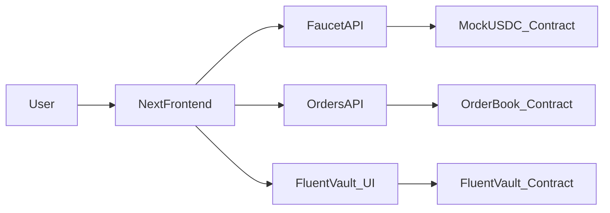

## FluentVault

FluentVault 是一个完整的 Web3 DeFi 示例项目，围绕「ERC‑4626 收益金库 + Gasless Intent Trading」构建，从合约到前端、后端与工程化链路全部打通。

- 基于 Foundry 的 Solidity 合约（ERC‑4626 Vault + 策略模式 + EIP‑712 OrderBook）。
- 基于 Next.js 14 App Router 的前端与 Serverless API（Gasless Relayer + Upstash Redis 限流）。
- 深色 DeFi Trading Terminal 界面，采用 Tailwind 布局，注重工业级交互细节。

---

## Architecture

整体数据流向如下所示：



- `MockUSDC`：测试代币，支持 EIP‑2612 Permit，用于演示 Gasless 授权。
- `FluentVault`：基于 ERC‑4626 的收益金库，将资产托管给可插拔的收益策略（`MockYieldStrategy`）。
- `OrderBook`：支持 EIP‑712 的订单簿合约，Relayer 在链下聚合订单，在合适价格时调用 `executeOrder` 完成链上结算。
- `FaucetAPI`：Serverless 接口，使用 Upstash Redis 做限流 + viem 私钥账号调用 `MockUSDC.mint` 发放测试代币。
- `OrdersAPI`：Serverless 接口，负责接收 / 验证 / 存储 EIP‑712 签名订单与 Permit 签名。

---

## Engineering Highlights

- **ERC‑4626 Vault + 策略模式**
  - `FluentVault` 只负责 ERC‑4626 份额与存取逻辑，真实收益由实现 `IYieldStrategy` 的策略合约负责。
  - `MockYieldStrategy` 基于区块时间戳近似模拟 10% 年化收益，方便在前端以「收益跳动」的视觉形式展示资产增长。

- **EIP‑712 签名与 Order 验证**
  - `OrderBook` 合约定义 `Order` 结构与 `ORDER_TYPEHASH`，使用 EIP‑712 从结构体到 digest 的完整链路。
  - 后端 `/api/orders` 使用 viem 的 `recoverTypedDataAddress` 对订单做离线验签，确认签名者即 `maker` 后才入池。

- **Gasless 交互与 Permit 授权**
  - 前端 `usePermitSignature` Hook 封装 EIP‑2612 Typed Data 构造 + `signTypedData`，返回 `v/r/s/nonce/deadline`。
  - `OrderBook.executeOrder` 先用 Permit 授权再 `transferFrom` 扣款，实现免前置 Approve 的链上结算流程。

- **Serverless Relayer 与 Upstash Redis 限流**
  - `/api/faucet` 利用 `incrementAndCheckLimit` 对 IP / 地址做双重限流（例如每小时 1 次），并通过 viem WalletClient 调用 `MockUSDC.mint`。
  - `/api/orders` 将订单与 Permit 签名统一存入内存订单池，未来可以替换为 Supabase 或任意数据库驱动的持久化实现。

- **前端 Hooks 与事件驱动刷新**
  - `useLiveVaultBalance` 在读取一次链上数据后，使用 `requestAnimationFrame` 按 10% APY 规则在前端侧模拟资产滚动增长，避免高频 RPC。
  - `useWatchVaultEvents` 订阅 `Deposit` / `Withdraw` / `OrderFilled` 事件，基于事件驱动 UI 刷新，而不是固定时间轮询。

---

## Quick Start

### 1. 克隆与安装依赖

```bash
git clone git@github.com:YOUR_GITHUB/fluent-vault.git
cd fluent-vault
pnpm install
```

### 2. 配置环境变量

复制根目录的 `.env.example` 为 `.env`，并根据实际情况填写：

- `SEPOLIA_RPC_URL`：Sepolia RPC（如 Infura/Alchemy）。
- `ETHERSCAN_API_KEY`：用于 Foundry 验证合约（可选）。
- `FAUCET_PRIVATE_KEY`：仅用于测试网的 Faucet / Relayer 私钥。
- `MOCK_USDC_ADDRESS`、`FLUENT_VAULT_ADDRESS`、`ORDER_BOOK_ADDRESS`：通过 Foundry `Deploy.s.sol` 部署后填写。
- `UPSTASH_REDIS_REST_URL`、`UPSTASH_REDIS_REST_TOKEN`：Upstash Redis 凭证。

### 3. 部署合约（本地 & Sepolia）

#### 3.1 本地 Anvil 链部署（推荐先本地调试）

1. 在一个终端中启动本地链：

```bash
cd fluent-vault
anvil
```

2. 在另一个终端中运行本地部署脚本，它会自动将合约地址写入 `.env.local`：

```bash
cd fluent-vault
pnpm deploy:local
```

执行完成后，`.env.local` 中会包含：

- `SEPOLIA_RPC_URL=http://127.0.0.1:8545`（名称沿用，值指向本地 RPC）
- `MOCK_USDC_ADDRESS` / `FLUENT_VAULT_ADDRESS` / `ORDER_BOOK_ADDRESS`（本地部署地址）
- 对应的 `NEXT_PUBLIC_*` 变量与本地链 `CHAIN_ID=31337`

#### 3.2 部署到 Sepolia 测试网

1. 根据 `.env.example` 创建并填写 `.env` 中的：

- `SEPOLIA_RPC_URL`
- `DEPLOYER_PRIVATE_KEY`（原注释中的部署私钥，需有 Sepolia 测试 ETH）

2. 运行 Sepolia 部署脚本，它会自动更新 `.env` 中的合约地址和相关 `NEXT_PUBLIC_*` 变量：

```bash
cd fluent-vault
pnpm deploy:sepolia
```

#### 3.3 环境切换约定

- 日常本地开发推荐使用 `.env.local`（默认连本地 Anvil）。
- 需要连 Sepolia 时，可以暂时重命名 `.env.local` 或清空其中链相关变量，前端/后端会回退使用 `.env`。

### 4. 启动前端

```bash
pnpm dev:frontend
```

访问 `http://localhost:3000` 即可看到 FluentVault Trading Terminal：

- 点击 `Get Test Tokens (Faucet)` 领取 MockUSDC。
- 输入下单数量 / 价格，开启 `Enable Gasless Permit` 并点击 `Sign & Place Gasless Order`。
- 右侧浮窗会实时解释当前操作对应的协议与架构流程。

---

## Security & Testing

- **Foundry 测试与覆盖率**
  - `packages/contracts/test` 中包含 `MockUSDC`、`MockYieldStrategy`、`FluentVault`、`OrderBook` 的单元测试。
  - 可通过 `forge test` 运行测试，并使用 `forge coverage` 生成覆盖率报告（命令需根据本地 Foundry 版本适配）。

- **安全实践**
  - Vault 外部入口使用 `ReentrancyGuard`，并在注释中明确了资产流向与重入假设。
  - OrderBook 对 `nonce` 与 `expiry` 做校验，避免重放与过期订单被执行。
  - Permit 的 EIP‑712 Domain 与 Typed Data 均在合约与前后端代码中显式定义，降低实现偏差风险。
  - Serverless API 尽量不直接暴露敏感信息，私钥仅在服务端使用，且 `.env.example` 中已标明仅用作测试环境配置。

